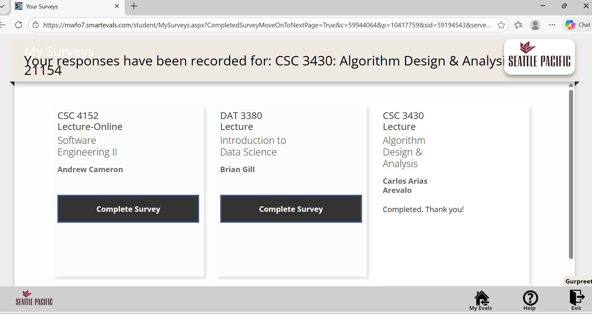
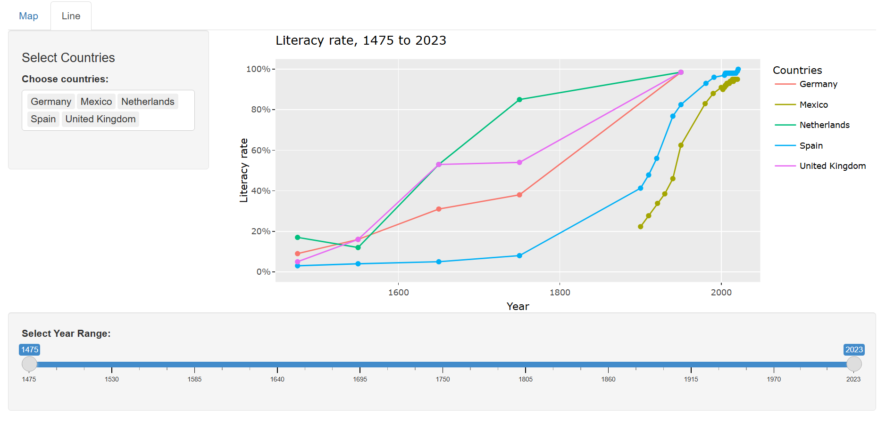

# Global Literacy Rates

## Project Overview

Literacy is a foundational skill. Children need to learn to read so that they can "read to learn," and failing to teach this skill limits opportunities for a rich and fulfilling life. This project visualizes global literacy rates, focusing on adults aged 15 and older who can read and write simple everyday sentences. 

Measuring literacy over time is challenging, as definitions of literacy differ across countries and historical periods. To address this challenge, the visualization combines historical and modern datasets to provide a long-term perspective on literacy trends from 1475 to 2023.

The app allows users to explore literacy data both geographically and temporally through two interactive visualizations: a world map and a time-series line graph. 

- **Map:** The map view displays literacy rates for countries around the world in a selected year.

- A **year slider** allows users to choose a year between **1475 and 2023**.
- Since literacy data is not available for every country every year, the map displays the **most recent recorded literacy rate that is less than or equal to the selected year**.
- Countries are **shaded according to their literacy rate**, making it easy to identify global patterns and regional differences.

Users can **hover over a country** to view detailed information, including:

- Country name  
- Literacy rate  
- The most recent year for which data is available  

This visualization helps users quickly understand **global literacy distribution at a specific point in time**.

- **Line Graph:** The line graph view shows how literacy rates change **over time** for selected countries.

- Users can **select multiple countries** to compare their literacy trends.
- A **year-range slider** allows users to filter the data by choosing a **minimum and maximum year**.
- Each country is represented by a **line that tracks literacy rates across time**.

Users can **hover over data points** to see detailed information, including:

- Country name  
- Year  
- Literacy rate  

## Key Insights

One clear pattern in the data is that developed countries consistently show very high literacy rates, often approaching universal levels. This reflects widespread access to formal education, well-established schooling systems, and social investments in basic education over the past century. In these countries, nearly all adults are able to read and write simple sentences, which indicates that basic literacy is no longer a barrier to participation in most aspects of civic and economic life.

Over the last few centuries, literacy rates have increased dramatically worldwide. In the early 19th century, only a small fraction of the global population could read and write, mostly concentrated among elites. The expansion of public education, especially after the mid-20th century, has allowed literacy to spread rapidly across large populations. Many countries experienced sharp increases in literacy rates between 1950 and the present, highlighting the positive effects of educational policies, international development efforts, and social reforms aimed at universal schooling. Historical trends reveal that improvements in literacy often precede broader social and economic development, making it a key indicator of progress.

Despite these gains, significant disparities remain across regions and countries. Low- and middle-income countries, particularly in parts of Sub-Saharan Africa and South Asia, continue to struggle with low literacy rates. For example, countries such as Afghanistan, Mali, Niger, Guinea, and South Sudan still have adult literacy rates below 40% in some cases, reflecting persistent challenges in education. These gaps are often linked to structural barriers such as poverty, limited access to schools in rural regions, gender inequality in education, and political or social instability. The data underscores that while literacy is improving globally, access to education remains uneven, and large populations in these countries are still at risk of missing out on this foundational skill.

Finally, these trends demonstrate both progress and the work that remains. Younger generations in most countries show higher literacy rates than older cohorts, suggesting continued improvements over time. However, the persistent gaps in some regions remind us that achieving universal literacy remains a critical global challenge. By visualizing these patterns, the app highlights the importance of sustained investments in education and the need to address structural barriers that prevent equitable access to basic literacy skills worldwide.

## Technologies and Libraries

- R
- Shiny
- Plotly
- ggplot2
- sf
- rnaturalearth

## Data

[**Literacy rate**](https://ourworldindata.org/grapher/cross-country-literacy-rates?tab=map#all-charts) – Our World in Data

## Visualizations

### Map

### Line Graph

## Explore the Live App

[**Gerry's Graphs**](https://gerrys02.shinyapps.io/gerrysgraphs/)
